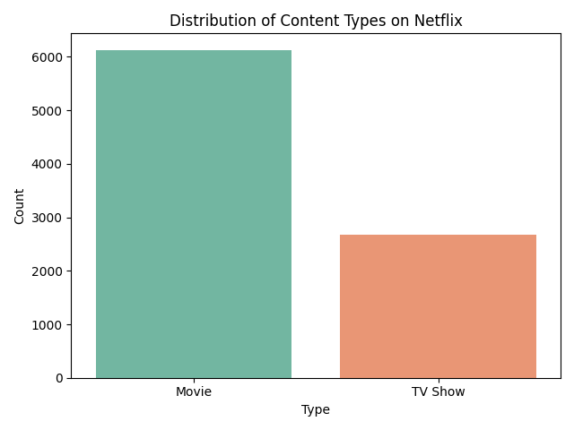
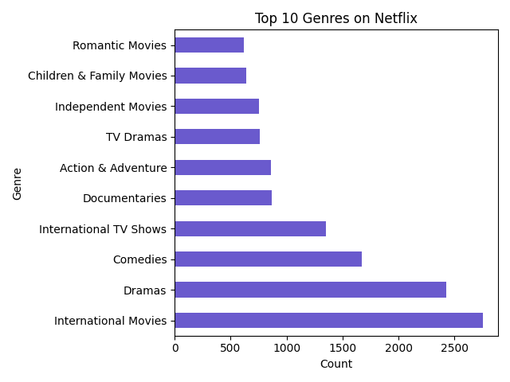
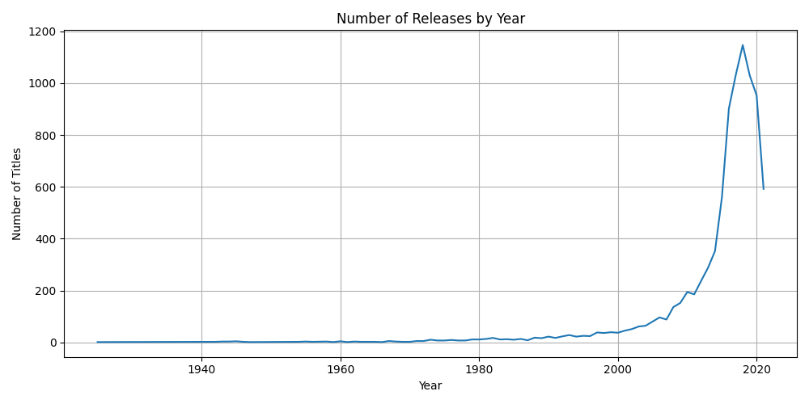

# Netflix Content Analysis 📺

This project explores the Netflix titles dataset using Python (Pandas, Matplotlib, Seaborn). We examine trends in content types, genres, countries, and release patterns over time.

## 📊 Dataset
- Source: [Kaggle - Netflix Titles](https://www.kaggle.com/datasets/shivamb/netflix-shows)
- Size: 8807 entries, 12 columns

## 📌 Objectives
- Distribution of content types (Movie vs TV Show)
- Top 10 genres and countries by content count
- Content release trends over time
- Heatmap of additions per year and month

## 🔧 Tools Used
- Python (Jupyter Notebook)
- Pandas
- Matplotlib & Seaborn
- Git & GitHub

## 📎 Charts Preview
All charts are saved in the [`charts/`](./charts) folder.

  
  
  

## 🧠 Key Insights
- Most content on Netflix are movies.
- US dominates content production, followed by India.
- International Movies and Dramas lead in genre distribution.
- Content additions peaked in 2019–2020 and slightly dropped after.

## 🚀 How to Run
1. Clone the repo
2. Run `jupyter notebook`
3. Open `netflix_analysis.ipynb`
